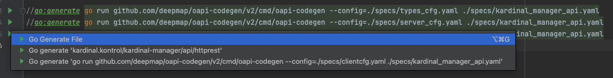

# Kardinal

## Developing instructions

1. Enter the dev shell and start the local cluster:

```bash
nix develop
```

2. You're also likely to use a local k8s, in this case minikube is available to use:

```bash
kubectl config set-context minikube
minikube start --driver=docker --cpus=10 --memory 8192 --disk-size 32g
minikube addons enable ingress
minikube addons enable metrics-server
minikube dashboard
```

### Regenerate REST API Bindings

You can either:

1. Press the green play button in `kontrol-service/kardinal-manager/api/http_rest/generate.go` in Goland
   
2. Or execute the following go from the repository root

```bash
go generate ./kontrol-service/kardinal-manager/api/http_rest/generate.go
```

### Regenerate gomod2nix.toml

You will need to do this every time the `go.mod` file is edited

```bash
# inside the kontrol-service directory
nix develop
gomod2nix generate
```

## Deploying Kontrol to local cluster

You can use tilt deploy and keeping the image hot-reloading:

```bash
tilt up
```

Or manually build it:

```bash
# First set the docker context to minikube
eval $(minikube docker-env)
docker load < $(nix build ./#kardinal-manager-container --no-link --print-out-paths)
kubectl apply -f kontrol-service/deployment
```

## Removing Kontrol from local cluster

```bash
kubectl delete -f kontrol-service/deployment/k8s.yaml
```

## Deploying Redis Overlay Service to local cluster

Building and loading image into minikube:

```bash
# First set the docker context to minikube
eval $(minikube docker-env)
docker load < $(nix build ./#redis-proxy-overlay-container --no-link --print-out-paths)
```

To build and run the service directly:

```bash
nix run ./#redis-proxy-overlay
```

## Publishing multi-arch images

Too publish multi-arch images, you can use the following command:

```bash
$(nix build .#publish-<SERVICE_NAME>-container --no-link --print-out-paths)/bin/push

# For instance, to publish the redis proxy overlay image:
$(nix build .#publish-redis-proxy-overlay-container --no-link --print-out-paths)/bin/push
```

## Demos

This repo contains the [Argo Rollouts](https://github.com/argoproj/argo-rollouts) demo application source code and examples. It demonstrates the
various deployment strategies and progressive delivery features of Argo Rollouts.

Before running an example:

On another terminal, start the tunnel:

```bash
minikube tunnel
```

And if using the Argo Rollout, start the dashboard (optional):

```bash
kubectl apply -n <namespace> -f rbac-rollout-dashboard.yaml
kubectl port-forward -n <namespace> services/argo-rollouts-dashboard 3100:3100
```

<details>
  <summary>Kardinal demo</summary>

```bash
cd k8s-demos
kubectl create namespace kardinal-demo
kubectl apply -n kardinal-demo -f https://github.com/argoproj/argo-rollouts/releases/latest/download/install.yaml
kubectl apply -n kardinal-demo -f kardinal-demo
kubectl port-forward -n kardinal-demo service/frontend 8080:80
```

Start to rollout changes to the frontend service:

```bash
kubectl argo rollouts -n kardinal-demo set image frontend "*=lostbean/microservice-frontend:banner1"
kubectl argo rollouts -n kardinal-demo set image frontend "*=lostbean/microservice-frontend:banner2"
```

</details>

<details>
  <summary>Google microservices demo (optional)</summary>

### Adding Istio and Kiali

```bash
# Install Istio in the local cluster with the demo profile
istioctl install --set profile=demo -y

# Install Kiali and the other Addons
kubectl apply -f https://raw.githubusercontent.com/istio/istio/release-1.10/samples/addons/prometheus.yaml
kubectl apply -f https://raw.githubusercontent.com/istio/istio/release-1.10/samples/addons/grafana.yaml
kubectl apply -f https://raw.githubusercontent.com/istio/istio/release-1.10/samples/addons/jaeger.yaml
kubectl apply -f https://raw.githubusercontent.com/istio/istio/release-1.10/samples/addons/kiali.yaml
kubectl rollout status deployment/kiali -n istio-system

# Access into the Kiali dashboard
istioctl dashboard kiali
```

### Deploy the microservices-demo with sidecars (make sure Istio is already installed if you need the sidecars)

```bash
kubectl create namespace ms-demo
# Adding the label for injecting the Istio sidecars
kubectl label namespace ms-demo istio-injection=enabled
kubectl apply -n ms-demo -f microservices-demo
# or directly from the Github repo
# kubectl apply -n ms-demo -f https://raw.githubusercontent.com/GoogleCloudPlatform/microservices-demo/main/release/kubernetes-manifests.yaml
kubectl port-forward -n ms-demo deployment/frontend 8080:8080
```

</details>

<details>
  <summary>Argo B/G Demo (Optional)</summary>

```bash
kubectl create namespace argo-demo
kubectl apply -n argo-demo -f https://github.com/argoproj/argo-rollouts/releases/latest/download/install.yaml
kubectl apply -n argo-demo -f argo-demo
```

```bash
minikube service -n argo-demo bluegreen-demo --url
minikube service -n argo-demo bluegreen-demo-preview --url
```

Watch the rollout or experiment using the argo rollouts kubectl plugin:

```bash
kubectl argo rollouts -n argo-demo get rollout bluegreen-demo --watch
```

For rollouts, trigger an update by setting the image of a new color to run:

```bash
kubectl argo rollouts -n argo-demo set image bluegreen-demo "*=argoproj/rollouts-demo:yellow"
```

</details>
